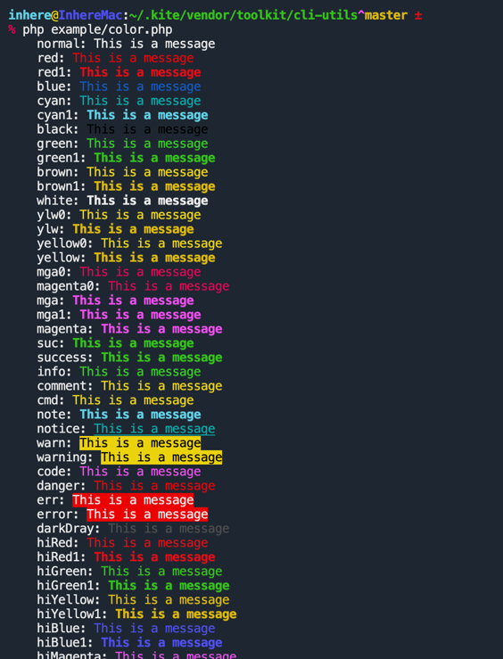
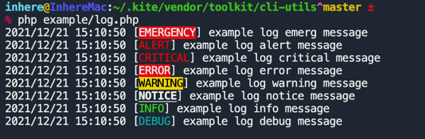
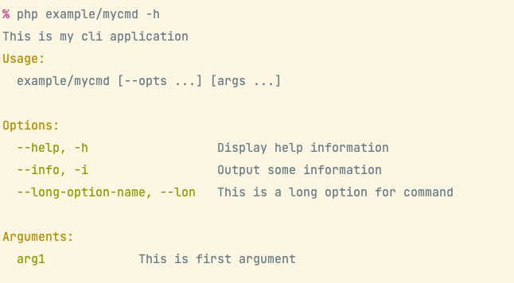

# CLI Utils

[](LICENSE)
[](https://packagist.org/packages/toolkit/cli-utils)
[](https://packagist.org/packages/toolkit/cli-utils)
[](https://github.com/php-toolkit/cli-utils/actions)

Provide some useful utils for the php CLI application. 

- Simple CLI arguments and options parser.
- Terminal console color render
- CLI code highlighter
- Build simple CLI application
- CLI ENV information helper

## Install

- Required PHP 8.0+

```bash
composer require toolkit/cli-utils
```

## Console color

```php
Color::printf('<info>%s</info> world', 'hello');
Color::println('hello world', 'info');
Color::println('hello world', 'error');
Color::println('hello world', 'warning');
Color::println('hello world', 'success');

echo Color::render('hello world', 'success');
```



## Console log

```php
use Toolkit\Cli\Util\Clog;

// run: php example/log.php
foreach (Clog::getLevelNames() as $level) {
    Clog::log($level, "example log $level message");
}

```



## Simple console app

```php
use Toolkit\Cli\CliApp;

// run:
// php example/mycmd
// php example/mycmd -i abc --lon def ag1 ag2 ag3
$cmd = CliApp::new('cmd1', 'this is my cli application');
$cmd->addOpt('info', 'i', 'Output some information');
$cmd->addOpt('long-option-name', 'lon', 'this is a long option for command');
$cmd->addArg('arg1', 'this is first argument');

$cmd->setHandler(function (CliApp $cmd) {
  var_dump($cmd->getOpts(), $cmd->getArgs(), $cmd->getRemainArgs());
});

$cmd->run();
```



## Terminal control

examples:

```php
use Toolkit\Cli\Util\Terminal;

Terminal::forward(3);
Terminal::backward(2);

Terminal::clearLine();

Terminal::clearScreen();
```

### Control Methods

```php
/**
 * @method static showCursor()
 * @method static hideCursor()
 * @method static savePosition()
 * @method static restorePosition()
 * @method static toTop()
 * @method static toColumn(int $step)
 * @method static up(int $step = 1)
 * @method static down(int $step = 1)
 * @method static forward(int $step = 1)
 * @method static backward(int $step = 1) Moves the terminal cursor backward
 * @method static toPrevNLineStart(int $step = 1)
 * @method static toNextNLineStart(int $step = 1)
 * @method static coordinate(int $col, int $row = 0)
 * @method static clearScreen()
 * @method static clearLine()
 * @method static clearToScreenBegin()
 * @method static clearToScreenEnd()
 * @method static scrollUp(int $step = 1)
 * @method static scrollDown(int $step = 1)
 * @method static showSecondaryScreen()
 * @method static showPrimaryScreen()
 */
```

## PHP file highlight

> This is inspire `jakub-onderka/php-console-highlighter`

```php
use Toolkit\Cli\Util\Highlighter;

// this is an comment
$rendered = Highlighter::create()->highlight(file_get_contents(__FILE__));

\Toolkit\Cli\Cli::write($rendered);
```


## CLI downloader

```php
use Toolkit\Cli\Download;

$url  = 'http://no2.php.net/distributions/php-7.2.5.tar.bz2';
$down = Download::file($url, '');

// $down->setShowType('bar');
// $down->setDebug(true);
$down->start();
```

**Progress bar**


**Progress text**


## Projects 

- https://github.com/inhere/php-console Build rich console application
- https://github.com/php-toolkit/pflag Generic flags parse library, build simple console application.

## Refer

- https://www.sitepoint.com/howd-they-do-it-phpsnake-detecting-keypresses/

## License

[MIT](LICENSE)
