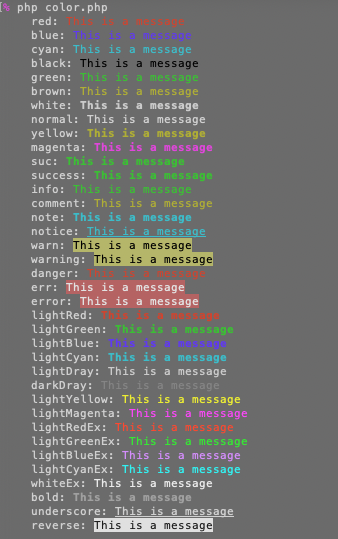
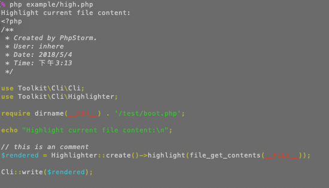
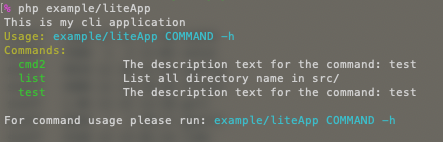
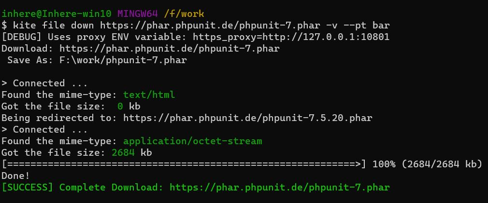
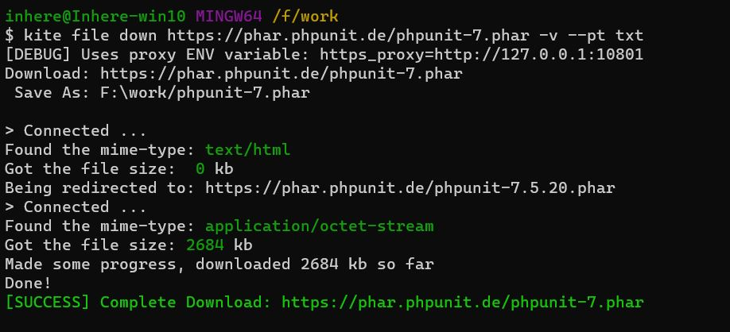

# CLI Utils

[](LICENSE)
[](https://packagist.org/packages/toolkit/cli-utils)
[](https://packagist.org/packages/toolkit/cli-utils)
[](https://github.com/php-toolkit/cli-utils/actions)

Provide some useful utils for the php CLI application. 

- Parse CLI arguments and options
- Console color render
- CLI code highlighter
- Build simple CLI application
- CLI ENV information helper

## Install

```bash
composer require toolkit/cli-utils
```

## Console color

```php
Color::printf('<info>%s</info> world', 'hello');
Color::println('hello world', 'info');
Color::println('hello world', 'error');
Color::println('hello world', 'warning');
Color::println('hello world', 'success');

echo Color::render('hello world', 'success');
```



## PHP file highlight

> This is inspire `jakub-onderka/php-console-highlighter`

```php
use Toolkit\Cli\Highlighter;

// this is an comment
$rendered = Highlighter::create()->highlight(file_get_contents(__FILE__));

\Toolkit\Cli\Cli::write($rendered);
```



## Parse CLI arguments & options

```php
use Toolkit\Cli\Flags;

$argv = $_SERVER['argv'];
// notice: must shift first element.
$script = \array_shift($argv);
// do parse
[$args, $shortOpts, $longOpts] = Flags::parseArgv($argv);
```

## Build CLI application

You can quickly build an simple CLI application:

```php
use Toolkit\Cli\App;

// create app instance
$app = new App([
  'desc' => 'this is my cli application',
]);
```

### Register commands

Use closure:

```php
$app->addCommand('test', function ($app) {
    echo "args:\n";
    /** @var Toolkit\Cli\App $app */
    /** @noinspection ForgottenDebugOutputInspection */
    print_r($app->getArgs());

}, 'the description text for the command: test');
```

Use closure with a config:

```php
$app->addByConfig(function ($app) {
    echo "args:\n";
    /** @var Toolkit\Cli\App $app */
    /** @noinspection ForgottenDebugOutputInspection */
    print_r($app->getArgs());

}, [
  'name' => 'cmd2',
  'desc' => 'the description text for the command: test',
]);
```

Use an object:

```php
use Toolkit\Cli\App;

class MyCommand
{
    public function getHelpConfig(): array
    {
        $help = <<<STR
Options:
  --info    Output some information

Example:
  {{fullCmd}}

STR;

        return [
            'name'  => 'list',
            'desc'  => 'list all directory name in src/',
            'help'  => $help,
        ];
    }

    public function __invoke(App $app)
    {
        echo "hello\n";
    }
}

// add command
$app->addObject(new MyCommand);
```

### Run application

```php
// run
$app->run();
```

Run demo: `php example/liteApp`



## CLI downloader

```php
use Toolkit\Cli\Download;

$url  = 'http://no2.php.net/distributions/php-7.2.5.tar.bz2';
$down = Download::file($url, '');

// $down->setShowType('bar');
// $down->setDebug(true);
$down->start();
```

**Progress bar**



**Progress text**



## Projects 

- https://github.com/inhere/php-console Build rich console application

## License

[MIT](LICENSE)
